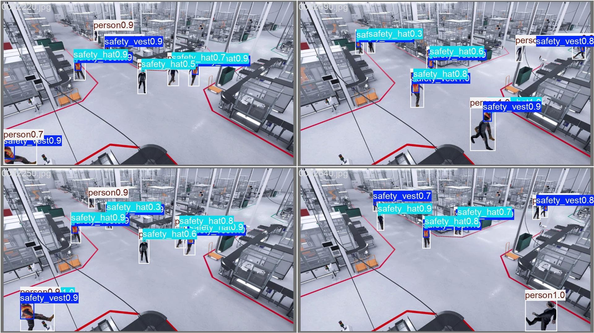
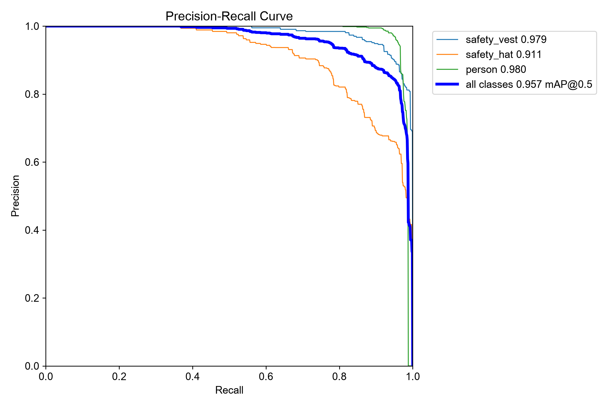
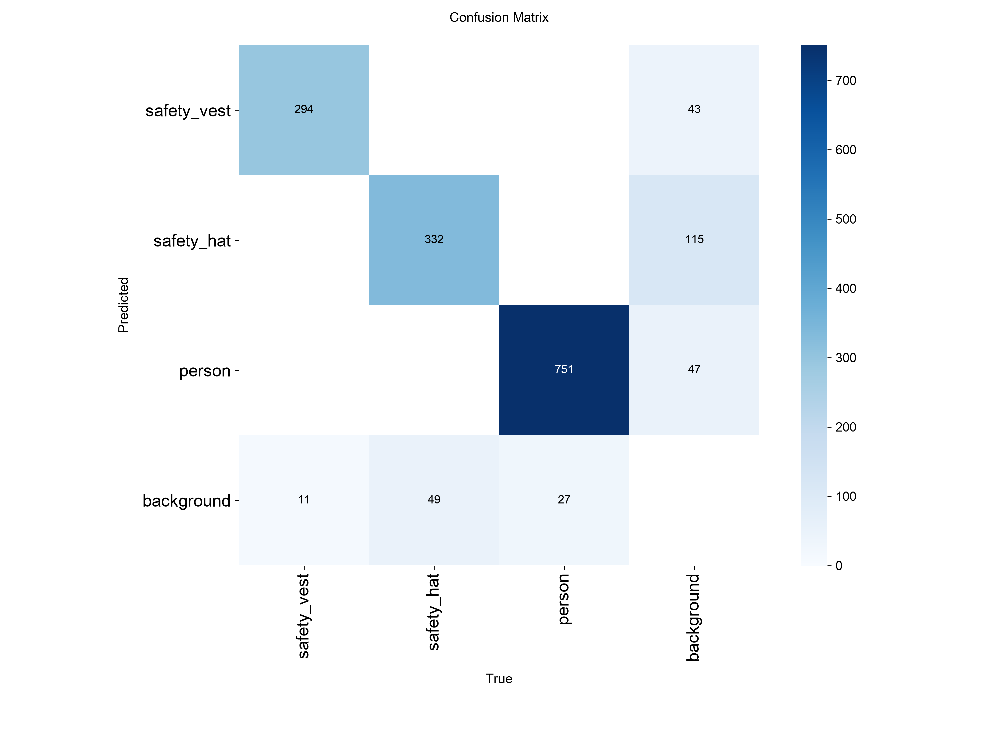

# YOLO Trainer

This part is responsible for training the YOLO model for detecting the vest and safety hat. And it is the part of DeltaCup project.

The video used for training is created by our team member from KMITL: N'Neil.




# Training Flow
1. Create the train, val, and test datasets [`01_extract_frame.py`](01_extract_frame.py). Define the dataset structure in [`dataset/ppe.yaml`](dataset/ppe.yaml).
2. Apply Grounding DINO [1] to generate the bounding box on security camera video [`02_gdino.py`](02_gdino.py).
3. Plot some extracted frames with bounding boxes to verify the dataset [`03_plot_examples.py`](03_plot_examples.py).
4. Train the YOLO [2] model [`04_train_yolo.py`](04_train_yolo.py).
5. Inference the trained model [`05_inference.py`](05_inference.py) on video.

# Getting started
1. Create python envrionment using uv.
```bash
uv init .
```

2. Install dependencies using `uv sync`.
```bash
uv sync
source .venv/bin/activate
```

3. run all the scripts
```bash
bash train.sh
```

# Results
The results are shown in the folder [`result`](result). For the weights of trained model, please contact the model owner ([bamboo51](https://github.com/bamboo51)).

PR curve:



Confusion matrix:



# Citations
[1] Shilong L., et al. "Grounding DINO: Marrying DINO with Grounded Pre-Training for Open-Set Object Detection." ECCV. 2024.
https://github.com/idea-research/groundingdino. 

[2] Ultralytics YOLO. https://github.com/ultralytics/ultralytics
